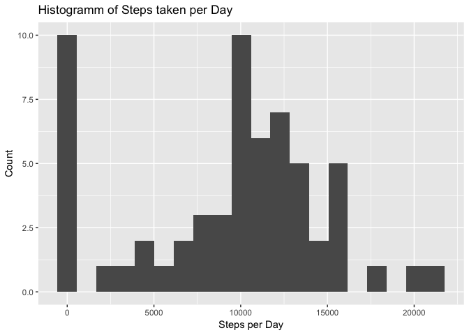
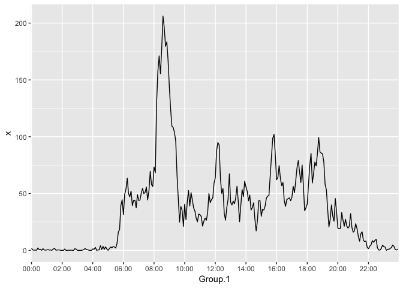
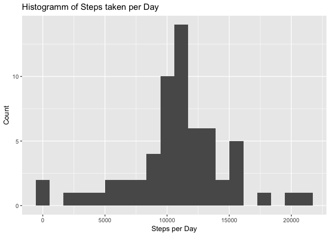

## Loading and preprocessing the data
### Preparing the Environment
This script has been created on a macOS High Sierra machine (64-bit). RStudio runs on version 1.1.453 and R on version 3.3.2 (64-bit).
First i'm gonna make sure, that your machine uses the same language setting as there could be problems when running the script (especially when dealing with Weekdays). If you're on a windows machine, replace "en_US.UTF-8" with "English", Linux should work ok.

```r
Sys.setlocale("LC_ALL","en_US.UTF-8")
```

```
## [1] "en_US.UTF-8/en_US.UTF-8/en_US.UTF-8/C/en_US.UTF-8/de_CH.UTF-8"
```

```r
Sys.setenv(TZ="Europe/Zurich")
```

I had also the need to set the timezone to avoid error messages (i think this can be adapted to your needs).

```r
Sys.setenv(TZ="Europe/Zurich")
```
I asume you already installed 'ggplot2' otherwise install it with 'install.packages("ggplot2")' and load it with.

```r
library(ggplot2)
```

### Loading the data
Now the environment should be ready for the rest of the script and we can start downloading the data from the internet using this Chunk.

```r
datafilename <- "activity.zip"
datasource <- "https://d396qusza40orc.cloudfront.net/repdata%2Fdata%2Factivity.zip"
download.file(datasource, datafilename, mode="wb")
```

This will download the activity.zip file into the working directory. The url used is stored in the variable datasource.
While the file is zipped, it will be unzipped in a variable called temp and then read with the 'read.csv()' function in a data frame named 'df'

```r
temp <- unz(datafilename, "activity.csv")
df <- read.csv(temp)
```

### Preprocessing the data
Looking at the content of the data set, one can see, that the intervalls are an abreviation of an hour format that only shows the needed numbers (e.g. 5 means 00:05 and 435 means 04:35), thats why i will modify the format of the intervall like this "hh:mm" for better reading and handling.
First store the intervall in the new format in a variable called timeString

```r
timeString <- sprintf("%04d", df$interval, df$interval)
```

Now this timeString can be used for the replacement of the content of the given 'interval' column with this new 'timeString' content.

```r
df$interval <- paste(substr(timeString, 0, 2), ":", substr(timeString, 3, 4), sep="")
```

For better handling with the day names (put them in the correct order) i create another data frame 'addDays' containing all week days and the number of the week day (i start with monday).

```r
allDays <- data.frame(day = c('Monday', 'Tuesday', 'Wednesday', 'Thursday', 'Friday', 'Saturday', 'Sunday'), dayNumber = c(1,2,3,4,5,6,7))
```

Now the data set is ready for the research.

## What is mean total number of steps taken per day?

Getting the total number of steps taken per day is achieved using this code to store it as a data frame in the variable calles 'sumStepsPerDay', be aware of the 'na.rm=TRUE'.

```r
sumStepsPerDay <- aggregate(df[,c('steps')], by=list(df$date), FUN=sum, na.rm=TRUE)
```

And visualize a histogram with following chunk.

```r
qplot(sumStepsPerDay$x, xlab = "Steps per Day", ylab = "Count", main = "Histogramm of Steps taken per Day", bins= "20")
```

<!-- -->

To calculate the mean of the total number of steps taken per day we must first add a 'day' column to the 'sumStepsPerDay' data frame for proper grouping.

```r
sumStepsPerDay$day <- weekdays(as.Date(sumStepsPerDay$Group.1))
```

Now we are ready to calculate the median of the total number of steps taken per day. First store the 'mean' in the variable 'meanStepsPerDay'.

```r
meanStepsPerDay <- aggregate(sumStepsPerDay[,c('x')], by=list(sumStepsPerDay$day), FUN=mean, na.rm=TRUE)
```

Now merge the data frame with 'allDays' to allow correct ordering of the ouput and display the result.

```r
meanStepsPerDay <- merge(meanStepsPerDay, allDays, by.x = "Group.1", by.y = "day")
meanStepsPerDay[order(meanStepsPerDay$day),][,1:2]
```

```
##     Group.1         x
## 2    Monday  7758.222
## 6   Tuesday  8949.556
## 7 Wednesday 10480.667
## 5  Thursday  7300.222
## 1    Friday  9613.111
## 3  Saturday 10968.500
## 4    Sunday 10743.000
```

and changing the 'FUN' from 'mean' to 'median' will give us the median of the total number of steps taken per day. Store it in the variable medianStepsPerDay and do the same processing for odering (also see the 'mean' part)

```r
medianStepsPerDay <- aggregate(sumStepsPerDay[,c('x')], by=list(sumStepsPerDay$day), FUN=median, na.rm=TRUE)
medianStepsPerDay <- merge(medianStepsPerDay, allDays, by.x = "Group.1", by.y = "day")
medianStepsPerDay[order(medianStepsPerDay$day),][,1:2]
```

```
##     Group.1       x
## 2    Monday 10139.0
## 6   Tuesday  8918.0
## 7 Wednesday 11352.0
## 5  Thursday  7047.0
## 1    Friday 10600.0
## 3  Saturday 11498.5
## 4    Sunday 11646.0
```

The 'x' column in both stands for the 'mean' or 'median' and the 'Group.1' obviously for the day.

## What is the average daily activity pattern?

To visualize the average daily activity pattern i first store the mean of all steps per interval in a data frame named 'meanStepsPerInterval'. For better a better visual experience, store the ticks of the x-axis in a variable calles 'ticks'. It contains all 24th entries from 'df$interval' which means a tick every second hour.

```r
meanStepsPerInterval <- aggregate(df[,c('steps')], by=list(df$interval), FUN=mean, na.rm=TRUE)
ticks <- meanStepsPerInterval[seq(1, nrow(meanStepsPerInterval), 24),][,1]
```

After creating the ticks it is easy to build the time series plot with ggplot2.

```r
ggplot(data=meanStepsPerInterval, aes(x=Group.1, y=x, group=1)) + geom_line() + scale_x_discrete(breaks = c(ticks))
```

<!-- -->

To find out what interval has the highest mean of steps use following code:

```r
highestInterval <- meanStepsPerInterval[ meanStepsPerInterval$x == max(meanStepsPerInterval$x),]
highestInterval
```

```
##     Group.1        x
## 104   08:35 206.1698
```

## Inputing missing values
First lets find out how many NAs are in the original data set.

```r
sum(is.na(df$steps))
```

```
## [1] 2304
```

Now we can continue and replacing the NAs after creating a copy of the original data set, so both are available for comparison. I will take the mean steps of the intervalls from all days.

```r
dfNoNA <- df
dfNoNA$steps <- with(dfNoNA, ifelse(is.na(dfNoNA$steps), aggregate(dfNoNA[,c('steps')], by=list(dfNoNA$interval), FUN=mean, na.rm=TRUE)[,2], df[,1]))
```

Now create the histogram and calculating the mean and medians like before but this time using the data set with replaced NAs. I use the same variable names and just add 'NoNA'. But first the histogram.

```r
sumStepsPerDayNoNA <- aggregate(dfNoNA[,c('steps')], by=list(dfNoNA$date), FUN=sum)
qplot(sumStepsPerDayNoNA$x, xlab = "Steps per Day", ylab = "Count", main = "Histogramm of Steps taken per Day", bins= "20")
```

<!-- -->

Adding again the day names for proper grouping.

```r
sumStepsPerDayNoNA$day <- weekdays(as.Date(sumStepsPerDayNoNA$Group.1))
```

and finally calculate means.

```r
meanStepsPerDayNoNA <- aggregate(sumStepsPerDayNoNA[,c('x')], by=list(sumStepsPerDayNoNA$day), FUN=mean)
meanStepsPerDayNoNA <- merge(meanStepsPerDayNoNA, allDays, by.x = "Group.1", by.y = "day")
meanStepsPerDayNoNA[order(meanStepsPerDayNoNA$day),][,1:2]
```

```
##     Group.1         x
## 2    Monday 10150.709
## 6   Tuesday  8949.556
## 7 Wednesday 11676.910
## 5  Thursday  8496.465
## 1    Friday 12005.597
## 3  Saturday 12314.274
## 4    Sunday 12088.774
```

and the medians

```r
medianStepsPerDayNoNA <- aggregate(sumStepsPerDayNoNA[,c('x')], by=list(sumStepsPerDayNoNA$day), FUN=mean)
medianStepsPerDayNoNA <- merge(medianStepsPerDayNoNA, allDays, by.x = "Group.1", by.y = "day")
medianStepsPerDayNoNA[order(medianStepsPerDayNoNA$day),][,1:2]
```

```
##     Group.1         x
## 2    Monday 10150.709
## 6   Tuesday  8949.556
## 7 Wednesday 11676.910
## 5  Thursday  8496.465
## 1    Friday 12005.597
## 3  Saturday 12314.274
## 4    Sunday 12088.774
```

We see, when we compare the results from the data set with NAs and the data set where the NAs are replaced with the means, it gives us higher values overall when the NAs are replaced by mean values.


## Are there differences in activity patterns between weekdays and weekends?

For this question we first need to add a column that tells if the measures are on a weekday or weekend.
Lets store the weekdays in the variable 'wDays'.

```r
wDays <- c('Monday', 'Tuesday', 'Wednesday', 'Thursday', 'Friday')
```

Now first i add the 'day' column to the 'dfNoNA' witch determines the day name according the date.
Adding the 'wday' variable to the 'dfNoNA' will tell us, if this day is a weekday or on a weekend.

```r
dfNoNA$day <- weekdays(as.Date(dfNoNA$date))
dfNoNA$wDay <- with(dfNoNA, ifelse(dfNoNA$day %in% wDays, "weekday", "weekend"))
```

So we can use this to create two variables named 'meanStepsPerIntervalNoNAwd' and 'meanStepsPerIntervalNoNAwe' (wd for weekday and we for weekend).

```r
meanStepsPerIntervalNoNAwd <- aggregate(subset(dfNoNA, wDay == 'weekday')[,c('steps')], by=list(subset(dfNoNA, wDay == 'weekday')$interval), FUN=mean)
meanStepsPerIntervalNoNAwd$wDay <- 'weekday'
meanStepsPerIntervalNoNAwe <- aggregate(subset(dfNoNA, wDay == 'weekend')[,c('steps')], by=list(subset(dfNoNA, wDay == 'weekend')$interval), FUN=mean)
meanStepsPerIntervalNoNAwe$wDay <- 'weekend'
```

To prepare the plot, again create the 'ticks' for a 2 hour scale on the x axis and use 'rbing' to bring 'meanStepsPerIntervalNoNAwd' and 'meanStepsPerIntervalNoNAwe' into 'meanStepsPerIntervalNoNA'

```r
ticks <- meanStepsPerIntervalNoNAwd[seq(1, nrow(meanStepsPerIntervalNoNAwd), 24),][,1]
meanStepsPerIntervalNoNA <- rbind(meanStepsPerIntervalNoNAwd, meanStepsPerIntervalNoNAwe)
```

And the create the plot with ggplot2 and facet.

```r
ggplot(data=meanStepsPerIntervalNoNA, aes(x=Group.1, y=x, group=1)) + geom_line() + scale_x_discrete(breaks = c(ticks)) + facet_grid(wDay ~ .)
```

<!-- -->
